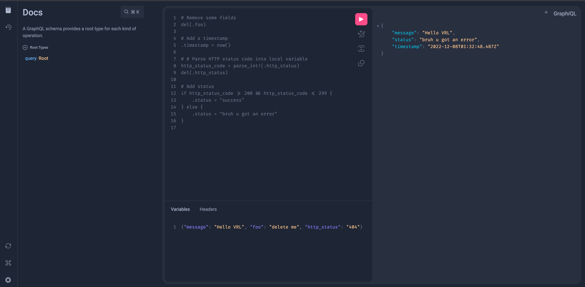

## GraphiQL Playground with vrl-js

This example demonstrates modifying the graphiql front end React implementation with VRL, simulating how a full-fledged
React app could be built around VRL.

Although the codebase is functional and runs VRL fairly smoothly, it was ultimately not the code repository we (Vector Processing
Team) opted to take due to the large monorepo that we would have to rewrite/modify/strip-down to leverage a nice UI for the
VRL web playground.

This will serve instead as an inspiration for the playground.

### Setup

1. Run `yarn` at root of the repository to install the dependencies.
1. Run `yarn build && yarn build-bundles` at the root to build graphiql for import
1. `yarn` and `yarn start` from this folder to start `react-scripts` dev server.
1. `yarn build` from this folder to build production ready transpiled files using `react-scripts`. Find the output in `build` folder.
